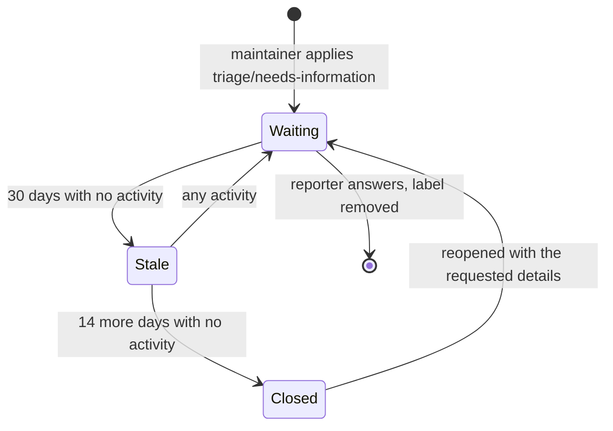

# Issue lifecycle

Most issues in this repository have no timer on them. A feature request or a design proposal can sit for a year and nothing will happen to it automatically — it stays open until somebody works on it or closes it deliberately.

There is exactly one automated path, and it applies only to issues that are blocked waiting for information from the person who reported them. This page describes that path in full.

## `triage/needs-information`

A maintainer applies this label when an issue cannot move without something only the reporter can supply — logs, the `backup.yaml` in use, the Milvus and milvus-backup versions, or the steps that reproduce the problem.

The label is a state bit meaning **"waiting on the reporter"**, not a permanent mark. It is removed automatically as soon as they answer.

## The countdown

| Step | Delay | Effect |
| --- | --- | --- |
| Marked stale | 30 days after the last activity | Adds the `stale` label and a comment saying what is missing |
| Closed | 14 days after being marked stale | Closes as `not_planned` with a comment inviting a reopen |

So an issue has 44 days from its last activity before it closes, and it is told at day 30 that the clock is running.

## What resets the countdown

| Who comments | `stale` | `triage/needs-information` | Result |
| --- | --- | --- | --- |
| The person who opened the issue | removed | **removed** | Leaves the automation entirely — the ball is back with the maintainers |
| Anyone outside the organization | removed | **removed** | Same; a third party supplying details also counts |
| A maintainer | removed | **kept** | Still waiting on the reporter, but the 30 day clock restarts from zero |

The last row is deliberate. A maintainer asking a follow-up question means the issue is still blocked on the reporter, so the label stays — but the reporter gets a fresh 30 days to respond to the new question rather than inheriting whatever was left of the old window.

## What is never touched

The automation is scoped with `only-labels`, which means an issue is considered only while it carries `triage/needs-information`. Everything else is out of reach regardless of age:

- issues without the label, however old
- feature requests, proposals and design discussions
- confirmed bugs that are waiting on maintainer work rather than on the reporter
- pull requests, which are excluded outright

A four-year-old feature request will not be closed by this workflow. That is the point of scoping it to a single label rather than running a general-purpose stale bot.

## If your issue was closed this way

It was closed as `not_planned` rather than `completed`, and that is not a judgement about whether the problem is real. It means the information needed to investigate never arrived.

Comment with the details that were requested and the issue can be reopened — by you, if you opened it, or by any maintainer. Nothing is lost; the history stays intact.

If the problem is still happening but you no longer have the environment that produced it, say so. A fresh issue against a current release is often easier to act on than reviving an old thread.

## For maintainers

Apply `triage/needs-information` at the moment you ask for something. That is the only manual step — you do not need to remove it later, and you do not need to track which issues have gone quiet.

Do not apply it to issues that are waiting on your own work. The label means the reporter owes us something; using it as a general "not now" marker will close issues that were never theirs to answer.

The two workflows implementing this are [`.github/workflows/stale.yaml`](../.github/workflows/stale.yaml) and [`.github/workflows/clear-needs-information.yaml`](../.github/workflows/clear-needs-information.yaml). The stale workflow accepts a `dry-run` input on manual dispatch, which lists what it would mark or close without changing anything.
