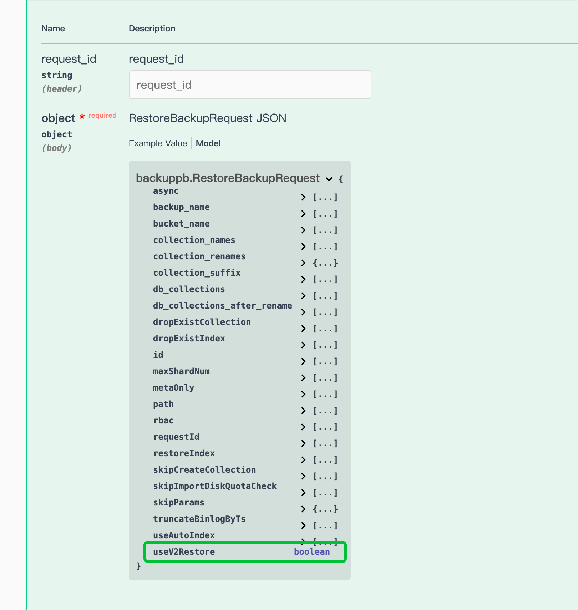

# multi-segment merged restore

## Background

In restore, each Segment used to trigger a separate BulkInsert job. While this approach (called v1 restore) is straightforward, it becomes inefficient when restoring Collections with a large number of Segments, due to the overhead of launching and scheduling a large number of jobs.

To address this, we've implemented multi-segment merged restore (v2 restore) that allows restoring multiple Segments in a single BulkInsert job, significantly reducing scheduling overhead.

In internal testing, we've observed up to 10x performance improvements when using this mode to restore large Collection.

> **Note**: This feature requires Milvus v2.4.0 or higher.

## How to use

### command line

To enable the v2 restore mode, use the `--use_v2_restore` flag:

```shell
./milvus-backup restore -n <backup_name> --use_v2_restore
```

### HTTP API

To enable the v2 restore mode, set the `use_v2_restore` field to `true` in the request body:

