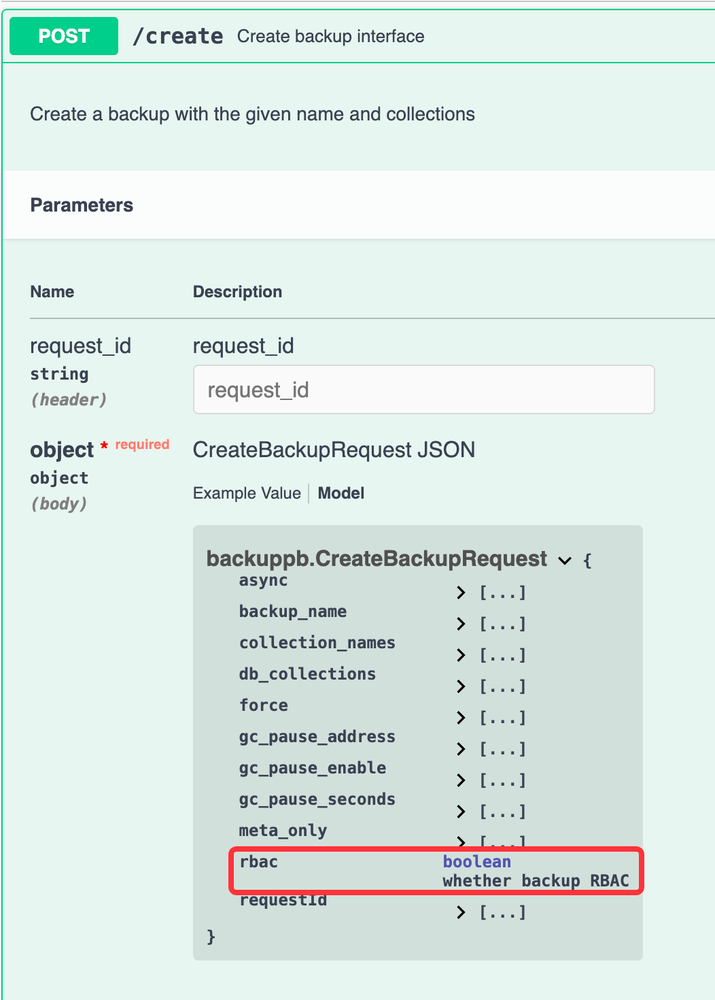

# RBAC backup

We support backup and restore RBAC meta since:

> milvus-backup: v0.4.21
>
> Milvus: v2.4.10

## Usage

### command
Add `rbac` parameter in `create` and `restore` command 

If set `--rbac`, will backup/restore RBAC meta.

```shell
./milvus-backup create -n backup --rbac
```

```shell
./milvus-backup restore -n backup --rbac
```

### API
Add `rbac` parameter in `create` and `restore` API request.

Backup


Restore
